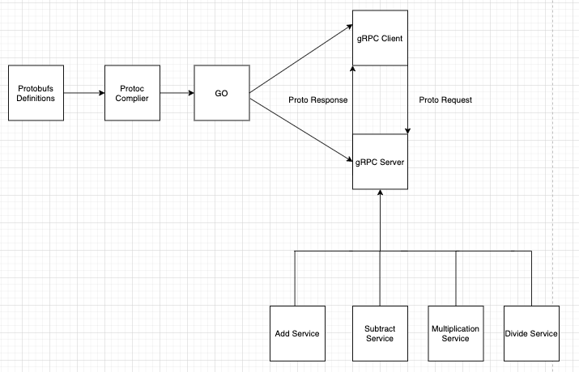

<h1>This is an application for calculation of addition, subtraction, multiplication and division using APIs of gRPC and protobuf with GoLang.</h1> 

*****

> # 1.1 System requirements for the project ☑
1) Document Introduction
    1) Purpose: Coding Test challenge 

2) Minimum  Requirements:
    1) Golang: 
        1) 2 GB of free RAM
        2) Any modern CPU
        3) disk space should be 2.5 Gb and another 1 GB for caches 
        4) MacOS 10.13.06 or later, or any kind of operating system.
    2) Visual Studio Code/VSC:
       1) 1.6 GHz or faster processor
       2) 1 GB of RAM
    3) Github account 

3) Product Description:
    1)  Create a gRPC server and client, where the application can do simple math tasks like (add, subtract, divide, multiply). Moreover, the client needs to input the operator or number of his choice via the IDE input.
    2) Finally, the server should reply to the request of the client and display the output on the STDOUT.
  
4.  User Requirements:
    1) The user must be able to run both the server and client at the same time.
    2) The user must be able to input operators or numbers.
    3) The user must be able to get output from the server and see the displayed output in the IDE.
5.  Functional Requirements: 
    1) The software must create the communication between the server and client using gRPC.
    2) The software should at least support addition, subtraction, multiplication and division.
   

 

>#### Figure 1: Please head to 1.4, where I explained the steps of the application.

***
***

> # 1.2 Installations instructions :✅ 
1) First of you need to download the latest version of golang --> here's the link for it <link>https://golang.org/</link>.
2) After downloading golang, you have to check if it's there, to do that just enter in your terminal  go --v.
3) Then you need to download protoc, we need it to install other packages in go. Head to terminal and enter this command ***brew install protobuf*** . Afterwards you can enter this command protoc --version  to check if its working.
4) Alternately, if you don't have homebrew then you can use this command to also install protoc go get -u github.com/golang/protobuf/{proto,protoc-gen-go}.
5) Another alternative is to install it by yourself through this website  https://github.com/protocolbuffers/protobuf/releases.
6) Up next is grpc, we also need it to use some packages in go, head to your terminal and enter    brew install grpc.
7) **o get -v  golang.org/x/tools/cmd/godoc**  --> this command is used to download godoc, usually when you install go, godoc will be installed as well, but in some cases you have to download it.Finally, you can then check in your IDE by entering godoc. Be aware go doc and godoc are different, so make sure that you enter godoc and check if it's installed. 
8) In order to generate client and server code go a head and install these two packages to get started: 
   1)  protoc --go_out=. --go_opt=paths=source_relative service/service.proto   -->  This command will generate a file with name service.pb.go. It contains all the method and struct, interfaces etc, that we can use for our function.
   2) protoc --go-grpc_out=. --go_opt=paths=source_relative service/service.proto  --> **generate for grpc**
 
9)  echo 'export PATH=$PATH:/usr/local/go/bin' >> $HOME/.bashrc  --> I had to use this command because my path wasn't correct and therefore i wasn't able to use  godoc -http:=6060 , so i used this command and entered the right path.
10)  You need to create a path for you project i used my github project repository path --> go mod init github.com/karim123450gif/grpc_codingtest #use your own path. 

***

> # 1.3 How to launch your own project: 🏁
1) Go to your terminal or IDE.
2) After installing all the necessary requirements.
3) Now you can head to your terminal and enter mkdir (the name of your project). This command will create a project for you.
4) Create your own github project repository.
5)  Go mod init **github.com/karim12345-gif/grpc_codingtest** #Use your own path ( this will add your path in your project).
6)  Now after creating the project and github path ,cd to your folder.
7)  Finally, start your project from your IDE, or if your using VSC just type in your terminal (code .) .

># 1.4 Guide to the project:🔴  

 1) Defining the service:
    1) To define the gRPC service and the method requests and response type using protocol buffers for the .proto file.
    2) Define rpc methods inside your service definition, specifying their request and response types. gRPC lets you define four kinds of service method, all of which are used in the  service Calculator.

1) Generating client and server code: 
   1) we need to generate the gRPC client and server interfaces from our .proto service definition. We do this using the protocol buffer compiler protoc with a special gRPC Go plugin. In the next step you will see the commands that will do that.
2) Running these command:
    1) route_guide.pb.go:contains all the protocol buffer code to populate, serialize, and retrieve request and response message types.
    2) route_guide_grpc.pb.go: contains an interface type for client to call with methods defined in the Calculator service. It also contains an interface for servers to implement, with the methods defined in the Calculator service .

3) Creating the server: 
   1) Implementing the service interface generated from our service definition: doing the actual work of our service.
   2) Running a gRPC server to listen for requests from clients and dispatch them to the right service implementation.

4) Implementing struct type that implements the generated interfaces. (add,divide,subtract,multiply)
5) Building the server will implement all our service methods that we need. For example  Add will get a AddRequest  from client and AddReply returns the corresponding information.
6) Start the server: 
    1) once all methods are implemented, we must start the gRPC server so that client can actually use these services,such as  addition and subtraction.
    2) To build and start a server, we need to specify a port number that we want to listen to for the client requests.
    3) Then we create an instance of the gRPC server. 
    4) Then we register our service with gRPC server.

7)  Create the client: 
    1) In order to communicate with the server, we must create a gRPC channel to easy our communication.
    2) We have to pass in the same address/port number that we wrote in the server.
    3) Once the gRPC Channel is all setup and ready, we need a client stub to preform the RPC. 

8)  Calling service methods in client: 
    1)  it's important to know that in gRPC-Go, RPCs operate in a blocking/synchronous mode, which means that the RPC call waits for the server to respond, and will either return a response or an error.
    2)  Then you can call your RPC, for ex in my project it was client.Add().
9)  Finally, Run the server and Client:
     1) Now you have to split the window into two so you can call the server and client at the same time.
     2) To call these files, you need to write go run foldername/filename.go. .
     3) Afterwards, you'll see the output on the terminal.
  

********

> # 1.5 Testing💡 (helpful resources)
1) Go testing files are always located in the same folder, or package, where the code they are testing resides. 
2) You don't need to install anything for testing 
3) The Go language provides a minimal yet complete package called testing  that developers use alongside the go test command. The testing package provides some useful conventions, such as coverage tests and benchmarks.
4) A test function in Go includes this signature: func Test..(t *testing.T) . This means that all test functions must start with the word Test, followed by a suffix whose first word is capitalized. Test functions in Go receive only one parameter, and in this case, it’s a pointer of type testing.T. This type contains useful methods that you will need to output results, log errors to the screen, and signal failures, like the t.Errorf() method for example.
5) After you finish writing your test, in order to test, you have to cd to that folder that contains the test file, and write either  go test or  go test -test.v 

>## <h4>some useful links that helped me understand how to apply unit testing to my code! </h4>

6) https://dzone.com/articles/testing-a-grpc-service-with-table-driven-tests-1 </ink>
7) http://www.inanzzz.com/index.php/post/w9qr/unit-testing-golang-grpc-client-and-server-application-with-bufconn-package
8) https://www.digitalocean.com/community/tutorials/how-to-write-unit-tests-in-go-using-go-test-and-the-testing-package
9) https://ieftimov.com/post/testing-in-go-failing-tests/

># Resources:
1) i would like to share some helpful resources that i used to get familiar with gRPC and how to build client/server system using golang. 
   1) https://medium.com/pantomath/how-we-use-grpc-to-build-a-client-server-system-in-go-dd20045fa1c2
   2) https://medium.com/@DreamsOfImran/learn-grpc-and-protobuf-with-golang-8456a2e64977
   3) https://grpc.io/docs/languages/go/basics/
   4) Stackoverflow 
   5) github
   6) reddit 
   

   

 